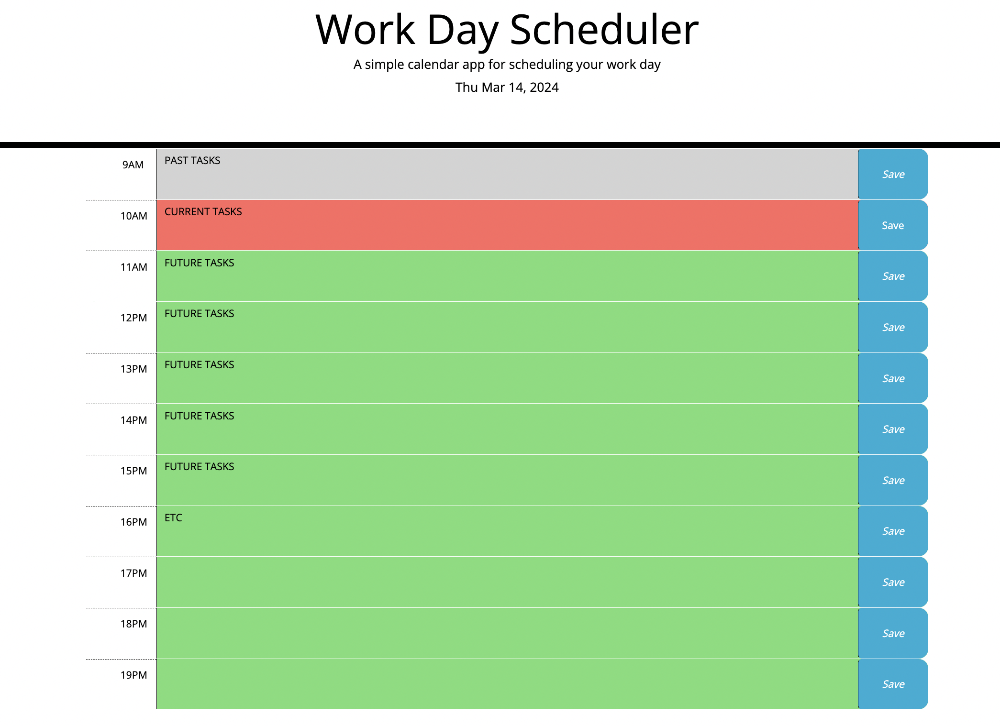

# daily-planner
# Third-Party APIs: Work Day Scheduler

## Description

This task required to create a simple calendar application  using [Day.js] library. This app will allow a users to save events for each hour of the day by modifying starter code. This app will run in the browser and feature dynamically updated HTML and CSS powered by jQuery.

## Installation
No installation is required as it can be displayed in a browser

## Usage

As a user:  An employee with a busy schedule a simple hour to hour visual tool is needed to keep track and do follow ups of tasks during the day. This app provides a schedule that keeps track of past, present and future events with colour blocks, so users can visually follow up of their tasks during busy days without relying on their memory.

## Credits
Research was made using Bootstrap and jquery websites tools and supported by TA and Tutors

## License
MIT
